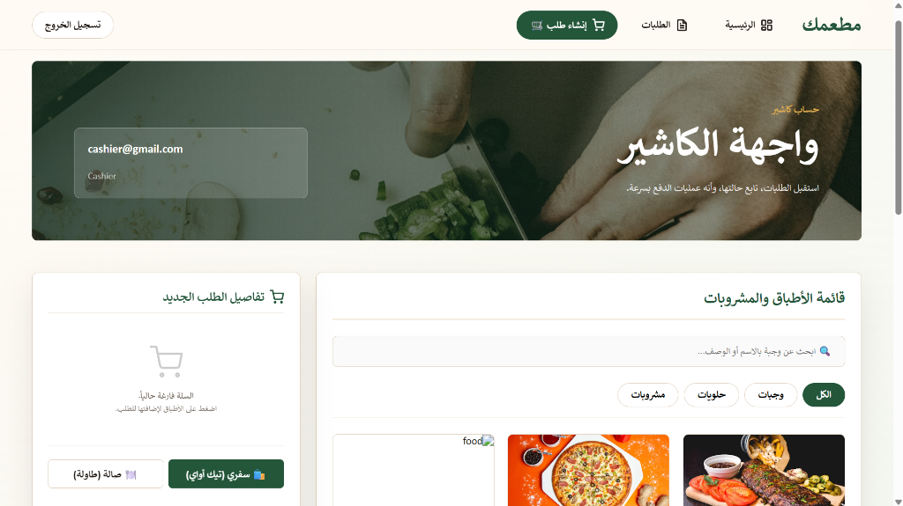
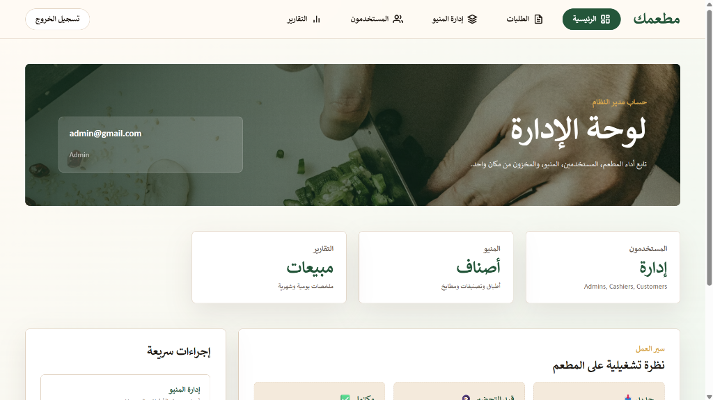

# 🍽️ مطعمك (Matamak) - نظام إدارة وطلب الوجبات للمطاعم

"مطعمك" هو نظام شامل وحديث لإدارة وطلب الوجبات في المطاعم، تم تصميمه لرقمنة العمليات اليومية المتعلقة بالأغذية. يربط النظام بين العملاء والكاشيرية ومسؤولي النظام (الآدمن) من خلال سير عمل سلس في الوقت الفعلي (Real-time)، مما يربط واجهة أمامية تفاعلية بالكامل مبنية بـ Angular مع واجهة خلفية قوية مبنية بـ C# .NET 10 Web API.

---

## 📖 فكرة المشروع

الفكرة الأساسية وراء "مطعمك" هي بناء منصة موحدة تدير دورة حياة طلبات المطعم بالكامل. يمكن للعملاء تصفح القوائم، تطبيق الخصومات، إجراء مدفوعات آمنة عبر الإنترنت، وتتبع حالة طلباتهم في الوقت الفعلي. يمكن للموظفين (الكاشيرية) إدارة ومعالجة الطلبات المحلية (Dine-in)، أو الطلبات الخارجية (Takeaway)، أو طلبات التوصيل (Delivery)، في حين يقوم المسؤولون (Admins) بإدارة المخزون، وتحليل تقارير المبيعات، وضبط إعدادات النظام. جميع هذه الميزات مفعّلة بالكامل وتفاعلية عبر كل من تطبيق الواجهة الأمامية والواجهة الخلفية (API).

---

## 🎯 أهداف المشروع

- **عمليات سلسة**: أتمتة مسارات العمل للطلبات المحلية (Dine-in)، الخارجية (Takeaway)، والتوصيل (Delivery).
- **التنسيق في الوقت الفعلي**: تقديم تحديثات فورية لحالة الطلبات باستخدام تقنية WebSockets.
- **صلاحيات آمنة**: تطبيق نظام التحكم في الوصول المستند إلى الأدوار (RBAC) للفصل بين العملاء، الكاشيرية، والمسؤولين.
- **واجهة مستخدم حديثة**: تقديم تجربة مستخدم بديهية، متجاوبة، وذات مظهر جمالي جذاب.
- **دمج الدفع الإلكتروني**: تمكين عمليات الدفع عبر الإنترنت من خلال محاكاة بوابة الدفع الإلكتروني (Paymob).

---

## 🛠️ التقنيات المستخدمة

### الواجهة الخلفية (Backend)

- **لغة البرمجة وبيئة التشغيل**: C# مع .NET 10 SDK
- **إطار العمل**: ASP.NET Core Web API (مبني على بنية Clean Architecture الهيكلية)
- **قاعدة البيانات والـ ORM**: SQL Server مع Entity Framework Core 10 (منهجية Code-First)
- **المصادقة والصلاحيات**: ASP.NET Core Identity مع التحقق من رموز JWT Bearer
- **الاتصال في الوقت الفعلي**: ASP.NET Core SignalR
- **خدمة البريد الإلكتروني**: MailKit & MimeKit (التكامل مع Gmail SMTP)
- **بوابة الدفع**: التكامل مع واجهة برمجة تطبيقات Paymob API
- **توثيق الواجهة البرمجية (API)**: Swagger UI / OpenAPI

### الواجهة الأمامية (Frontend)

- **إطار العمل**: Angular 22
- **لغة البرمجة**: TypeScript
- **إدارة البيانات والحالات**: RxJS Observables
- **التنسيق والتصميم**: Sass / SCSS، HTML5، Vanilla CSS

---

## ✨ الميزات الرئيسية

### 👤 تجربة العميل (Customer Experience)

- **الطلب عبر الإنترنت**: تقديم طلبات خارجية (Takeaway) أو توصيل (Delivery) مع إضافة ملاحظات مخصصة وحساب المجموع الكلي.
- **تصفح القائمة**: تصفية الوجبات حسب الفئة أو بلد المنشأ/المطبخ، مع البحث النصي الفوري في الوقت الفعلي.
- **سجل الطلبات وتتبعها**: الاطلاع على المعاملات السابقة، والحالات الفورية للطلبات، ومعرفات التتبع التسلسلية الفريدة لكل طلب.
- **إلغاء الطلبات الخارجية**: خيار إلغاء الطلب المباشر ("إلغاء الطلب") من صفحة الملف الشخصي للعميل.
- **التحكم في الحساب**: تسجيل الدخول، إنشاء الحساب، والتحقق عبر رمز OTP المرسل للبريد الإلكتروني لتفعيل الحساب أو إعادة تعيين كلمة المرور.

### 💼 تجربة الموظفين (لوحة تحكم الكاشير - Cashier Dashboard)

- **إدارة مسار عمل الطلبات**: عرض وتحديث الطلبات الحية المصنفة إلى محلي (Dine-In)، وخارجي (Takeaway)، وتوصيل (Delivery).
  - _التوصيل (Delivery)_: تحويل الحالة من قيد الانتظار (_Pending_) ➡️ مع السائق (_With Driver_) ➡️ مكتمل (_Completed_)، أو إلغاء الطلب.
  - _المحلي (Dine-In)_: تتبع حي للطاولات وتغيير حالاتها (قيد الانتظار _Pending_ ➡️ قيد الطهي _Cooking_ ➡️ تم تقديمها _Served_ ➡️ مكتمل _Completed_).
  - _الخارجي (Takeaway)_: تتبع وتحديث حالة طلبات الاستلام وإمكانية إلغائها.
- **الدفع السريع (Express Checkout)**: فتح قوائم العملاء وتقديم طلبات سريعة مباشرة من مكتب الاستقبال.
- **الإلغاء غير المدمر للبيانات**: إلغاء طلب سفري يقوم بتحديث حالته ديناميكيًا إلى "ملغي" (Canceled) بدلاً من حذفه نهائيًا من النظام، للحفاظ على السجلات المالية والإحصائية.

### 👑 لوحة تحكم الإدارة (لوحة تحكم المسؤول - Admin Dashboard)

- **إدارة قائمة الطعام**: واجهة تفاعلية بالكامل لعرض وإضافة وتعديل وحذف أصناف الطعام، الفئات، والبلدان/المطابخ. يدعم رفع ملفات الصور الفعلية مباشرة وحفظها على الخادم وعرضها ديناميكيًا عبر التطبيق.
- **التحكم في حسابات المستخدمين والموظفين**: استرجاع قائمة بجميع حسابات المسؤولين، الكاشيرية، والعملاء المسجلين، وإنشاء حسابات جديدة للمديرين أو الكاشيرية، أو حذف أي حساب.
- **تحليلات المبيعات والتقارير**: لوحة تقارير مخصصة مع فلاتر لتحديد نطاقات التواريخ لحساب إجمالي الإيرادات وعدد المعاملات الناجحة من الطلبات المدفوعة/المكتملة.
- **إدارة الكوبونات والعروض**: إدارة أكواد الخصم الثابتة أو بالنسبة المئوية.

---

## 📂 هيكل المجلدات (Folder Structure)

```text
Matamak/
├── Core/                       # طبقة العقود والنطاق البرمجي (Domain & Contracts)
│   ├── DTO/                    # كائنات نقل البيانات (Data Transfer Objects)
│   ├── IReprosatory/           # واجهات المستودعات (Repository Interfaces)
│   ├── IServices/              # واجهات الخدمات (Service Interfaces)
│   ├── Models/                 # نماذج جداول قاعدة البيانات (Database Entity Models)
│   └── ModelView/              # تمثيلات عرض النماذج (View Model representations)
├── Infrastructure/             # طبقة تفاصيل التنفيذ الأساسية (Core Implementation Detail)
│   ├── Context/                # سياق بيانات الـ EF (إعدادات SQL Server)
│   ├── Migrations/             # سكربتات ترحيل قاعدة البيانات (EF Code-First Migrations)
│   ├── Reprosatory/            # تطبيقات المستودعات (Repository Implementations)
│   └── Services/               # التكامل مع الأطراف الخارجية (Paymob, Email, SignalR)
├── Resturant/                  # مشروع الـ Web API (نقطة الدخول للنظام)
│   ├── Controllers/            # نقاط نهاية الواجهة البرمجية (API Endpoints)
│   ├── Properties/             # إعدادات التشغيل وتكوينات IIS
│   ├── Program.cs              # حقن الاعتماديات وخط أنابيب البرمجيات الوسيطة (DI & Middleware)
│   └── appsettings.json        # سلاسل الاتصال بقاعدة البيانات ومفاتيح الـ API
└── Matamak.Frontend/           # تطبيق العميل المبني بـ Angular
    ├── src/
    │   ├── app/
    │   │   ├── core/           # المصادقة، الخدمات، الحراس، والاعتراضات العامة (Guards & Interceptors)
    │   │   ├── features/       # وحدات الميزات المخصصة (المصادقة، العملاء، لوحة تحكم الموظفين)
    │   │   └── shared/         # التخطيطات المشتركة، مكونات واجهة المستخدم، والأنابيب (Pipes)
    │   └── environments/       # إعدادات البيئات المختلفة (التطوير والإنتاج)
    └── proxy.conf.json         # إعدادات الوكيل العكسي للـ API أثناء عملية التطوير
```

---

## 🚀 خطوات تشغيل المشروع

### المتطلبات الأساسية

- **نظام تشغيل Windows 10/11**
- **حزمة تطوير البرمجيات .NET 10 SDK**
- **بيئة تشغيل Node.js** (نسخة الدعم طويل الأمد LTS)
- **خادم قاعدة بيانات SQL Server** (نسخة LocalDB أو النسخة الافتراضية)

### 1. إعداد وتغذية قاعدة البيانات (Database Setup & Seeding)

تأكد من تشغيل خادم SQL Server محليًا. لتطبيق ترحيلات قاعدة البيانات وتغذيتها بالبيانات الافتراضية:

1. افتح نافذة الأوامر (Terminal) في المجلد الرئيسي للمشروع.
2. قم بتشغيل أمر تحديث قاعدة البيانات التالي:
   ```bash
   dotnet ef database update --project Infrastructure --startup-project Resturant
   ```
3. عند التشغيل الأول، تقوم الواجهة الخلفية تلقائيًا بتغذية قاعدة البيانات بالآتي:
   - **المستخدمون الإداريون**:
     - **المسؤول (Admin)**: البريد الإلكتروني: `admin@gmail.com` / كلمة المرور: `123456789`
     - **الكاشير (Cashier)**: البريد الإلكتروني: `cashier@gmail.com` / كلمة المرور: `147258369`
   - **قائمة الأطعمة**: إضافة ثلاث فئات رئيسية افتراضية (_وجبات، حلويات، مشروبات_) وإدراج 3 أطباق افتراضية تحت كل فئة (كاملة مع الأوصاف، الأسعار، والصور).

### 2. تشغيل الواجهة الخلفية (Backend API)

يمكنك تشغيل الواجهة الخلفية من خلال برنامج Visual Studio أو من خلال سطر الأوامر (CLI).

- **عن طريق Visual Studio (موصى به)**:
  - افتح ملف الحل `Matamak.sln` في Visual Studio 2022.
  - حدد مشروع **Resturant** كـ مشروع بدء التشغيل (Startup Project).
  - قم بالتشغيل باستخدام **IIS Express** (يستضيف الواجهة البرمجية على الرابط `https://localhost:44357` وهو ما يطابق إعدادات الوكيل العكسي للواجهة الأمامية).
- **عن طريق سطر الأوامر (CLI)**:
  - نفذ الأمر التالي:
    ```bash
    dotnet run --project Resturant
    ```
  - ملاحظة: قم بتحديث المنفذ المستهدف (Port) في ملف `Matamak.Frontend/proxy.conf.json` ليطابق منفذ الـ CLI النشط (`5270` أو `7092`).

### 3. تشغيل الواجهة الأمامية (Angular)

1. افتح نافذة الأوامر في مجلد `Matamak.Frontend/`.
2. قم بتثبيت الاعتماديات الخاصة بـ npm (إذا لم تقم بذلك مسبقًا):
   ```bash
   npm install
   ```
3. قم بتشغيل خادم التطوير المحلي لـ Angular:
   ```bash
   npm start
   ```
4. افتح المتصفح وانتقل إلى الرابط التالي: `http://localhost:4200`.

---

## 🖼️ لقطات شاشة من المشروع (Screenshots)

_إليك نظرة بصرية على الميزات المختلفة لنظام "مطعمك":_

### 👤 تجربة العميل (Customer Experience)

#### صفحة قائمة الطعام للعميل


### 💼 واجهة الموظفين والكاشير

#### لوحة تحكم الكاشير


#### شاشة تسجيل الطلبات للكاشير



### 👑 لوحة تحكم المسؤول (Administrator Panel)

#### نظرة عامة على لوحة تحكم المسؤول



#### إدارة قائمة الطعام


---

## ⚠️ التحديات التي تم مواجهتها وحلولها

- **انهيار الواجهة البرمجية عند خلو الجداول**: حل مشكلة استثناءات الواجهة الخلفية غير المعالجة عند طلب عناصر القائمة وقاعدة البيانات فارغة. تم إصلاح ذلك عن طريق استبدال إلقاء الاستثناءات بإرجاع قائمة فارغة في طبقات المستودع والخدمة.
- **هيكل لوحة تحكم المسؤول التجريبية**: ربط واجهات لوحة التحكم بالمنافذ والمسارات النشطة. تم حل المشكلة عن طريق كتابة منطق العمليات الأساسية (CRUD) للأصناف/الفئات/البلدان في `CatalogService` والاستعلام عن قائمة حسابات المستخدمين في `AuthService` وتحديثات حالات الطلبات والمخزون وجلب التقارير في `OrderService`.
- **تغييرات النماذج المعلقة في EF Core**: إدارة تضاربات الترحيل لـ Entity Framework عند إضافة حقول جديدة دون ترحيل. تم الحل عن طريق إضافة ترحيل موحد باسم `UpdatePendingModelChanges`.
- **قيود CORS**: حل مشكلة طلبات مشاركة الموارد عبر الأصول المختلفة بين تطبيق Angular المحلي (`localhost:4200`) وخادم API لـ ASP.NET Core. تم الحل من خلال إعداد برمجيات وسيطة (Middleware) تسمح بـ CORS في ملف `Program.cs`.
- **تصادمات نقاط Swagger**: تمت مواجهة أخطاء في التوجيه ومخطط Swashbuckle (HTTP 500) بسبب تكرار سمات أفعال HTTP على إجراءات التحكم الفردية. تم الحل عن طريق فصل الإجراءات وتطبيق تعيينات مسار فريدة.
- **رفع وعرض صور قائمة الطعام الديناميكية**: إصلاح مشكلة تجاهل تطبيق Angular لصور العناصر المرفوعة ديناميكيًا واستبدالها بصور عشوائية من موقع Unsplash. تم إنشاء نقطة نهاية مخصصة لرفع الصور بصيغة multipart-form على الواجهة الخلفية وحفظها في مجلد `wwwroot/uploads` وضبط مكونات وقوالب الواجهة الأمامية لتحليل وعرض هذا المسار المباشر (`imageUrl`).
- **الإلغاء غير المدمر للطلب الخارجي**: في البداية، كان إلغاء الطلبات الخارجية يؤدي لحذف سجلاتها من قاعدة البيانات وواجهة المستخدم. تم إعادة هيكلة سير العمل لتنفيذ تغيير حالة خفيف إلى ملغي (`Canceled`) وتعديل قواعد الصلاحيات على نقطة النهاية بحيث يمكن للمستخدم العادي (`Customer`) فقط طلب الإلغاء، بينما يمتلك المسؤول (`Admin`) والكاشير (`Cashier`) الصلاحية لتغيير الطلبات لأي حالة.
- **حسابات مبيعات وأرباح صفرية في التحليلات**: حل مشكلة خلو نتائج التحليلات والتقارير بسبب عدم ملء جدول سجلات الدفع في قاعدة البيانات. تم إعادة هيكلة منطق حساب تقارير المبيعات في لوحة التحكم للاستعلام عن إجمالي الإيرادات وإجمالي الأعداد مباشرة من جميع الطلبات الناجحة والمكتملة (`Paid`, `Completed`, `Delivered`).
- **إعادة تعيين معرفات الطلبات**: إصلاح مشكلة إعادة تعيين تسلسل تتبع الطلبات إلى رقم `#1` عند بدء جلسة جديدة أو يوم جديد، وذلك عبر استبدال عدادات واجهة المستخدم المؤقتة بالمفاتيح الأساسية التلقائية والفريدة المنتجة من قاعدة البيانات (`id`).

---

## 🔮 التحسينات المستقبلية

- **محلل تقارير متقدم**: دمج مكتبات مثل Chart.js أو D3.js في الواجهة الأمامية لتصور إحصاءات المبيعات بيانياً.
- **الحوسبة الحاوية (Dockerization)**: إنشاء ملفات Docker للواجهة الخلفية، الأمامية، وخادم SQL Server للسماح بنشر المشروع بأمر واحد.
- **خطوط أنابيب التطوير والدمج المستمر (CI/CD Pipeline)**: بناء مسارات عمل إجراءات GitHub (GitHub Actions) للاختبار الآلي وفحص جودة الكود (Linting).
- **إعادة هيكلة مخططات قاعدة البيانات**: مراجعة وتعديل بعض المسميات البسيطة في قاعدة البيانات (مثل تصحيح كتابة مسميات `Delivary` و `Oredr` و `Reprosatory`).

---

## 👥 أعضاء الفريق

- **مصطفى محمود أمين** - _قائد المشروع (Project Lead)_
- **زياد أيمن عبد السلام**
- **أحمد محمد عبد الله**
- **إبراهيم مدحت عباس**
- **بلال محمد عبده**

---

## 🎥 الفيديو التوضيحي

اضغط على الرابط أدناه لمشاهدة فيديو يشرح ميزات المشروع وهيكل الكود:

🔗 **[مشاهدة الفيديو التوضيحي للمشروع](https://www.youtube.com/watch?v=dQw4w9WgXcQ)** _(استبدله بالرابط الفعلي للفيديو الخاص بك)_
